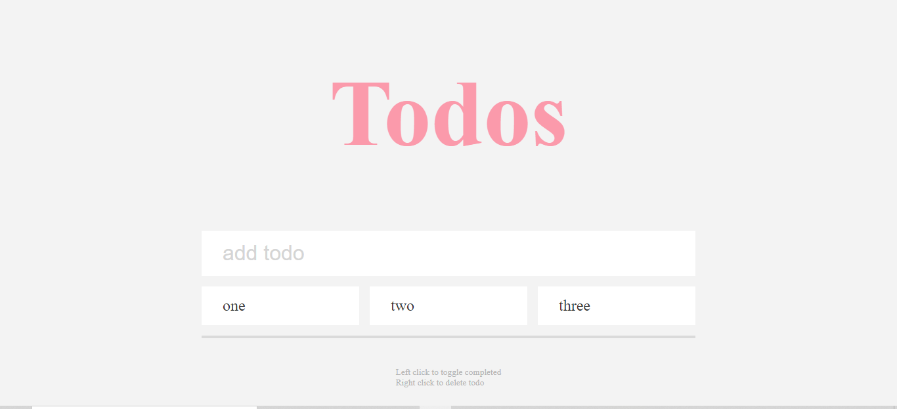

# A simple todo application in javascript
db:localstorage
1.create task  
2.Click on task to mark complete  
3.Right click to remove task  
# Project url
<a src="https://megatodos.netlify.app/">click here</a>
